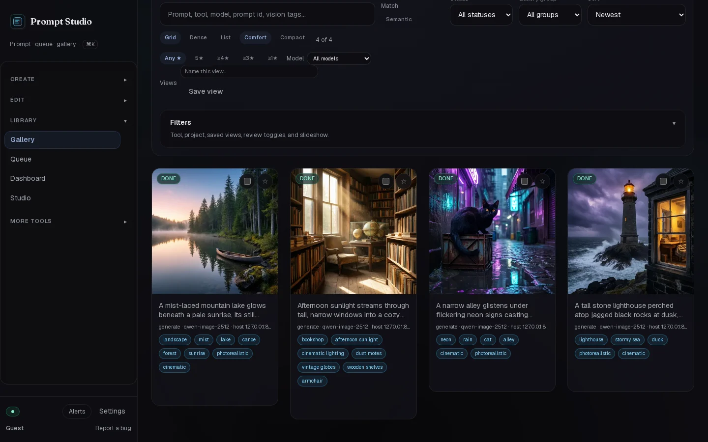
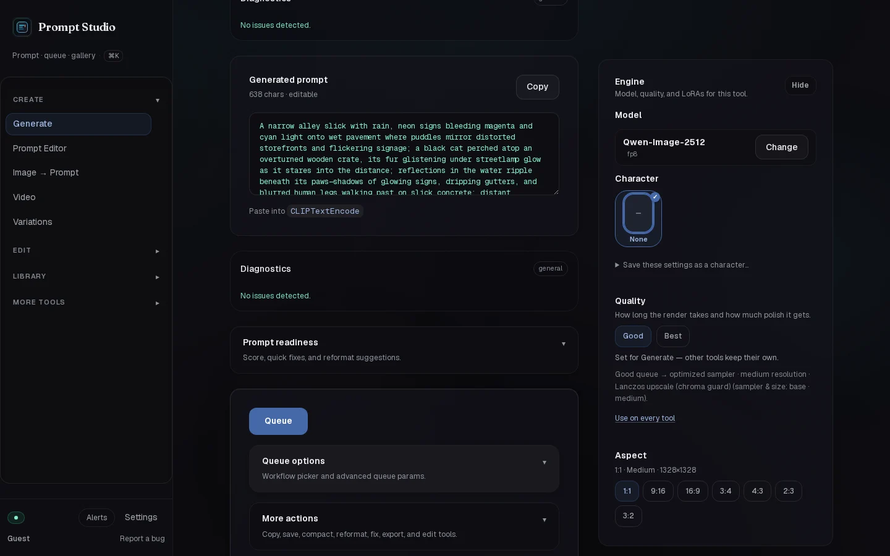
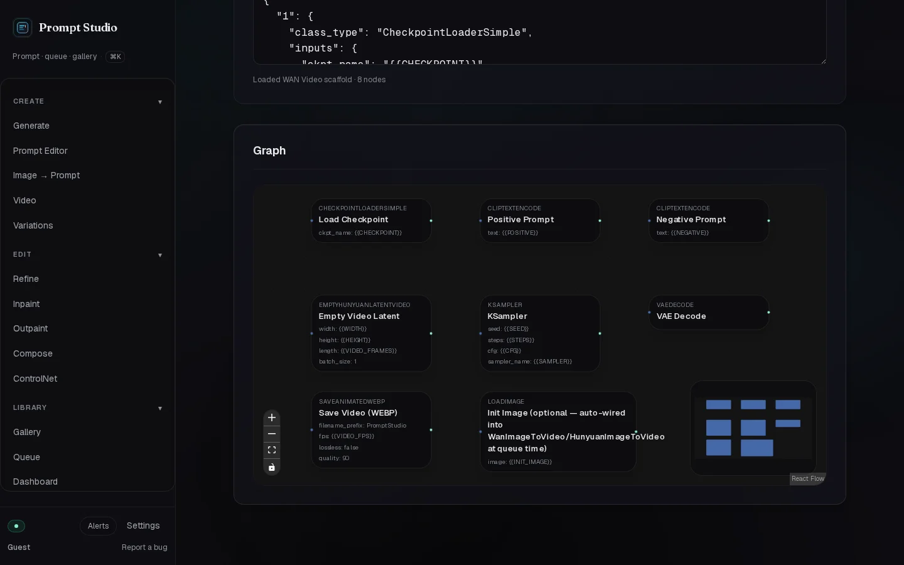
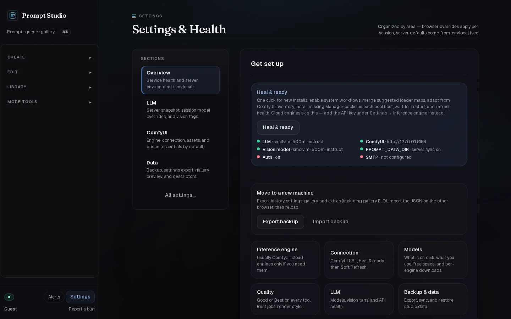

# Prompt Studio

**Prompt, image, video and audio tools for ComfyUI, running on your own machine.**

[](https://github.com/doodersrage/prompt-studio/actions/workflows/ci.yml)
[](https://www.npmjs.com/package/prompt-studio-core)
[](./LICENSE)

Write a scene idea, let a local LLM turn it into a model-ready prompt, and queue it on ComfyUI — then review, compare and keep the results in one Gallery. Prompt Studio picks the workflow, sampler and size for the model you choose and your GPU, so you spend your time on pictures, not on graphs.



## What's in it

- **Create** — Generate (keywords or a random surprise → a full prompt), Prompt Editor, Image → Prompt (vision), Video (text-to-video, image-to-video, extend), Variations (grid and matrix sweeps).
- **Edit** — Refine, Inpaint, Outpaint, Compose (multi-image edits), ControlNet.
- **Library** — Gallery (ratings, review mode, compare, semantic search, tags), Queue, Dashboard, Studio (history and diffs).
- **More tools** — Format, Lint, Negative prompts, the node graph Workflow editor, Topics, Audio, Mesh, Logo, Fantasy, Pet, Background, and plugins.
- **Engine** — Qwen-Image, FLUX, Z-Image, SDXL, WAN, LTX, Hunyuan and more on ComfyUI; Good / Best quality presets; a LoRA library; optional cloud engines (fal, Replicate, Gemini, Grok, Runway, Luma).
- **Heal & ready** — one click checks ComfyUI, maps your models, enables the system workflows and installs missing node packs.
- **Characters** — save a face lock, wardrobe and LoRAs as a character and use it on any tool.

| Generate | Workflow editor |
|---|---|
|  |  |



## Run it

Needs **Node 22+** and a running **[ComfyUI](https://github.com/comfyanonymous/ComfyUI)**. An OpenAI-compatible LLM server ([LM Studio](https://lmstudio.ai), [Ollama](https://ollama.com)) is optional, for prompt writing and vision.

```bash
git clone https://github.com/doodersrage/prompt-studio.git
cd prompt-studio
npm install
cp .env.example .env.local
npm run dev            # http://127.0.0.1:47833
```

Then open **Settings → Heal & ready**. For production: `npm run build && npm run start`.

The main settings in `.env.local`:

| Variable | What it is |
|---|---|
| `COMFYUI_API_URL` | Your ComfyUI, e.g. `http://127.0.0.1:8188` |
| `LLM_ENABLED`, `LLM_API_BASE_URL`, `LLM_MODEL`, `LLM_VISION_MODEL` | The LLM for prompt writing and vision (LM Studio: `http://127.0.0.1:1234/v1`) |
| `PROMPT_DATA_DIR` | Where the Gallery, history and settings live (default `.prompt-studio-data/`) |
| `PROMPT_AUTH_ENABLED`, `PROMPT_SESSION_SECRET` | Sign-in for shared machines (the secret is required when auth is on) |

Everything else is documented in [`.env.example`](./.env.example).

## How it is built

Prompt Studio is the classic toolset of [Castcut](https://github.com/doodersrage/castcut), which grew into a character-film app. The two share one core, published on npm as [`prompt-studio-core`](https://www.npmjs.com/package/prompt-studio-core): the ComfyUI pipeline, Gallery, settings, app shell and these tools. This repository is the app around it — the routes (generated), layout, configuration and public assets.

- **Updates:** a daily workflow (`.github/workflows/core-update.yml`) installs a newer core when one is published, regenerates the routes (`npm run sync-routes`), builds, and opens a pull request.
- **Changing the shared code** happens in the Castcut repository (`src/`); see its [architecture notes](https://github.com/doodersrage/castcut/blob/main/docs/architecture-boundaries.md).

On Linux with a system-wide libvips, install with `SHARP_IGNORE_GLOBAL_LIBVIPS=1 npm install` so `sharp` uses its prebuilt binaries.

## License

MIT — see [LICENSE](./LICENSE).
